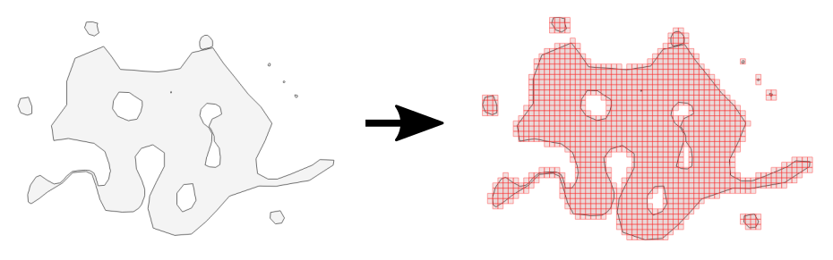

# Eurostat GridMaker

[GridMaker](https://github.com/eurostat/GridMaker) is a tool to produce grids of various resolutions covering user-defined countries or regions.



[GridMaker](https://github.com/eurostat/GridMaker) supports the creation of GIS datasets representing statistical grids based on the European ETRS89-LAEA coordinate reference system ([EPSG:3035](https://spatialreference.org/ref/epsg/etrs89-etrs-laea/)), which are compliant with the [Census 2021 regulation](https://ec.europa.eu/eurostat/web/population-and-housing-census/background), [the INSPIRE regulation](https://inspire.ec.europa.eu/id/document/tg/su) and the [GEOSTAT initiative](https://www.efgs.info/geostat/).

## Usage

### As a program

(TODO: Document)

### For coders

[GridMaker](https://github.com/eurostat/GridMaker) is available as a Java library. To quickly setup a development environment for such library, [see these instructions](ADD_URL).

Download and install [GridMaker](https://github.com/eurostat/GridMaker) with:

```
git clone https://github.com/eurostat/GridMaker.git
cd GridMaker
mvn clean install
```

and then use it in your Java project as a maven dependency:

```
<dependency>
	<groupId>eu.europa.ec.eurostat</groupId>
	<artifactId>GridMaker</artifactId>
	<version>X.Y</version>
</dependency>
```

with *X.Y* being the current version numbers.

Here is an example to create a 10m resolution grid over starting at point (0,0):

```java

StatGrid grid = new StatGrid()
		.setResolution(10)
		.setGeometryToCover(new Envelope(0, 1000, 0, 1000));

Collection<Feature> cells = grid.getCells();
```

This other example creates and saves as a *SHP file a grid covering Luxembourg, with a 5km resolution in the European ETRS89-LAEA coordinate reference system ([EPSG:3035](https://spatialreference.org/ref/epsg/etrs89-etrs-laea/)):

```java

//get country geometry
String countryCode = "LU";
Geometry cntGeom = CountriesUtil.getEuropeanCountry(countryCode, true).getDefaultGeometry();

//build cells
StatGrid grid = new StatGrid()
		.setResolution(5000)
		.setEPSGCode("3035")
		.setGeometryToCover(cntGeom)
		.setToleranceDistance(1000);

logger.info("Save " + grid.getCells().size() + " cells...");
SHPUtil.saveSHP(grid.getCells(), "path_to_my/file.shp", CRS.decode("EPSG:3035"));

```

For further overview, [see the documentation](URL_TO_JAVADOC).


## Support and contribution

Feel free to [ask support](https://github.com/eurostat/GridMaker/issues/new) or even contribute to the development of new features by [forking](https://help.github.com/en/articles/fork-a-repo) and pulling your modifications !
